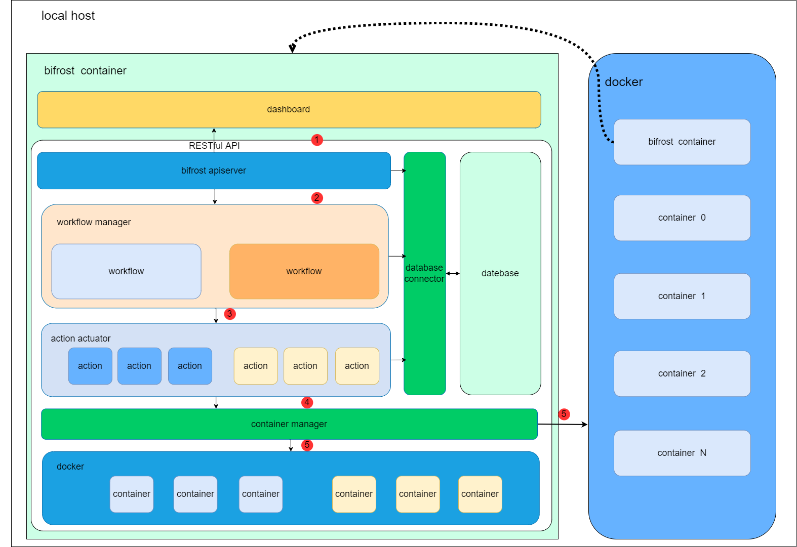

# Bifrost Specification

## Summary

When using a server to build various services for external exposure (such as setting up a private book service, requiring local deployment of services, DNS configuration, proxy routing, etc.), the configuration is more complex and it becomes difficult to manage when there are multiple services. Bifrost is dedicated to solving the one-click setup of service processes during the service building process and the management difficulties after building multiple services.


## Design

To impelment a general framework for expose service deployment and management, bifrost abstracts two types of resources, workflow and action. Workflow encompasses the overall deployment and management steps of a service, while action defines the behavior of one small step within it.

Let's give an example: I have a host in my home, and I want to deploy a private file service and expose it to the public network with the DNS `file.test.xxx`.

So the workflow should be as follows:
```yaml
name: exposeLocalFileService
description: Expose local file service to the public network
configurationSteps:
- use: action-deploy-file-server@v1
  name: deployFileServerInLocal
  in:
    ip: 192.168.1.3
    fileShareDir: /root/share
    serverPort: 8080

- use: action-routing-config@v1
  name: configRoutingInVPS
  in:
    localPort: 8080
    sshPassword: bifrost
    sshIP :8.8.8.8
    hostRoute :file.test.xxx

- use :action-dns-config@v1
   name:dnsConfig
   in :
     dnsProvider :googleCloud
     domainName :file.test.xxx
     backendIP :8.8.8.8
```

In this workflow file, there are three actions that can be used in other workflows and combined in any order or methods. With this workflow, users can easily deploy a file server, configure routing on a virtual private server, and configure DNS on a cloud DNS provider.

## Architecture

The overall architecture of Bifrost is as follows:



1. The `bifrost dashboard` will communicate with the backend through a RESTful API to handle workflow management.


### Specification

#### Action specification

##### Action API specification

The API specification will follow the following demo format:
```yaml
name: NginxRoutesConfig
# It will ssh to the remote server and add the 7-layer routes into the nginx configuration file
description: Config nginx routes
image: opennaslab/nginxroutesconfig:v0.1
parameter:
  in:
    server:
      type: string
      description: The server ip address or domain address used for ssh connection
      default: 127.0.0.1
      required: true
    serverPort:
      type: int
      description: The server port used for ssh connection
      default: 22
      required: true
    routes:
      type: array
      description: The route list to append
      required: true
      items:
        domain:
          type: string
          description: The domain name of the route
          required: true
        backendHost:
          type: string
          description: The backend ip address of the route
          required: true
        backendPort:
          type: int
          description: The backend port of the route
          required: true
  out:
    domainList:
      type: array
      description: The current domain route list
      required: true
      items:
        domain:
          type: string
          description: The domain name of the route
          required: true
        backendHost:
          type: string
          description: The backend ip address of the route
          required: true
        backendPort:
          type: int
          description: The backend port of the route
          required: true
```

* `name`: It must be a unique name in bifrost.
* `description`: The action's description.
* `image`: The docker image for the action.
* `parameter`: The action's parameter.
  * `in`: The input parameter for the action.
    * For a single parameter, it can be of three types: string, int, or array.
    * If it is an array type, it should have an additional field called `items`, which contains detailed fields for each element in the array.
  * `out`: The output parameter for the action. It follows the same specifications as the input (`in`) parameter.

##### Action implementation specification


#### Workflow API specification

#### Transmission of action information

#### Action implementation specification
